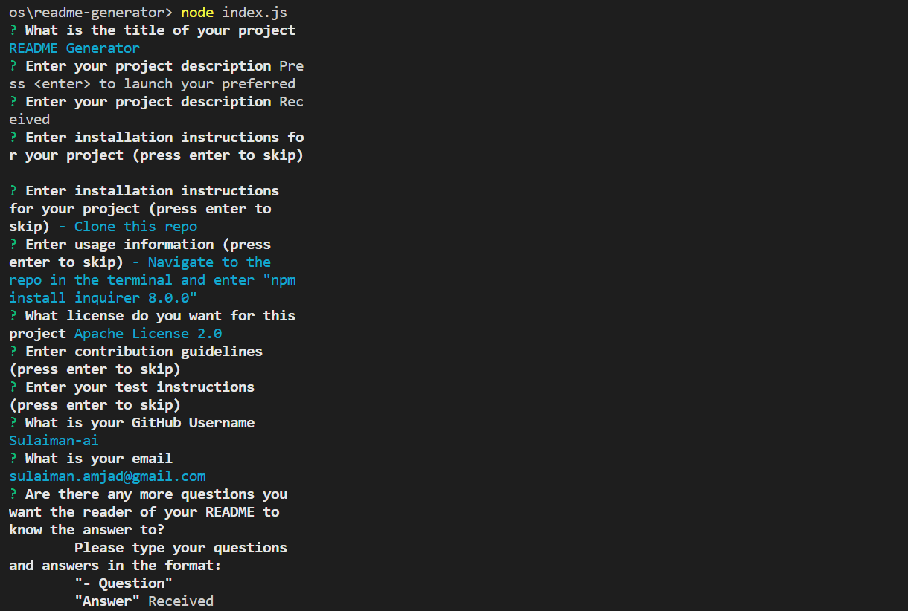

# README-Generator
Trilogy Bootcamp Module 11 Challenge - README Generator

## Description 

This project generates a README file for the user, based on input that the terminal application receives from the user. The code:
- Prompts the user for:
    - The title of my project
    - Description
    - Installation instructions
    - Usage instructions
    - License used for the project
    - Contribution information
    - Tests
    - Other questions a reader might have
- Generates a formatted README file based on the user's input

## Table of Contents

* [Installation](#installation)
* [Usage](#usage)
* [License](#license)

## Installation

- Clone this repo
- Navigate to the repo in the terminal and enter "npm install inquirer 8.0.0"

## Usage 

1. Navigate to the repo in the terminal
2. Enter "node index.js"
3. Terminal will prompt you with questions, answer the questions and hit enter

## License

Please refer to the license in the repo.